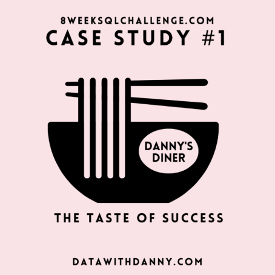

# Danny-Diner Analysis

___
## Table of Content

- [Project Overview](#project-overview)
- [Data Source](#data-source)
- [Tools](#tools)
- [Exploratory Data Analysis (EDA)](#exploratory-data-analysis-(EDA))
- [Data Analysis](#data-analysis)
- [Results](#results)
- [Recommendations](#recommendations)
___

### Project Overview

This Data Analysis project aims to answer a few simple questions about **Danny diner's** customers, especially about their visiting patterns, how much money they’ve spent and also which menu items are their favourite. He plans on using these insights to help him decide whether he should expand the existing customer loyalty program.

### Data Source

- Sales Table: Captures all **customer_id** level purchases with an corresponding **order_date** and **product_id** information for when and what menu items were ordered.

- Menu Table: Maps the **product_id** to the actual **product_name** and **price** of each menu item.

- Members Table: Captures the **join_date** when a **customer_id** joined the beta version of the Danny’s Diner loyalty program.

### Tools
SQL - Data Analysis
[Dowload here](https//microsoft.com)

The following SQL functions were used:
- Subquery
- CTE
- WHERE
- GROUP BY

### Exploratory Data Analysis (EDA)
  
EDA involved exploring the data to answer the key questions, such as:

1. What is the total amount each customer spent at the restaurant?
2. How many days has each customer visited the restaurant?
3. What was the first item from the menu purchased by each customer?
4. What is the most purchased item on the menu and how many times was it purchased by all customers?
5. Which item was the most popular for each customer?
6. Which item was purchased first by the customer after they became a member?
7. Which item was purchased just before the customer became a member?
8. What is the total items and amount spent for each member before they became a member?
9. If each $1 spent equates to 10 points and sushi has a 2x points multiplier - how many points would each customer have?
